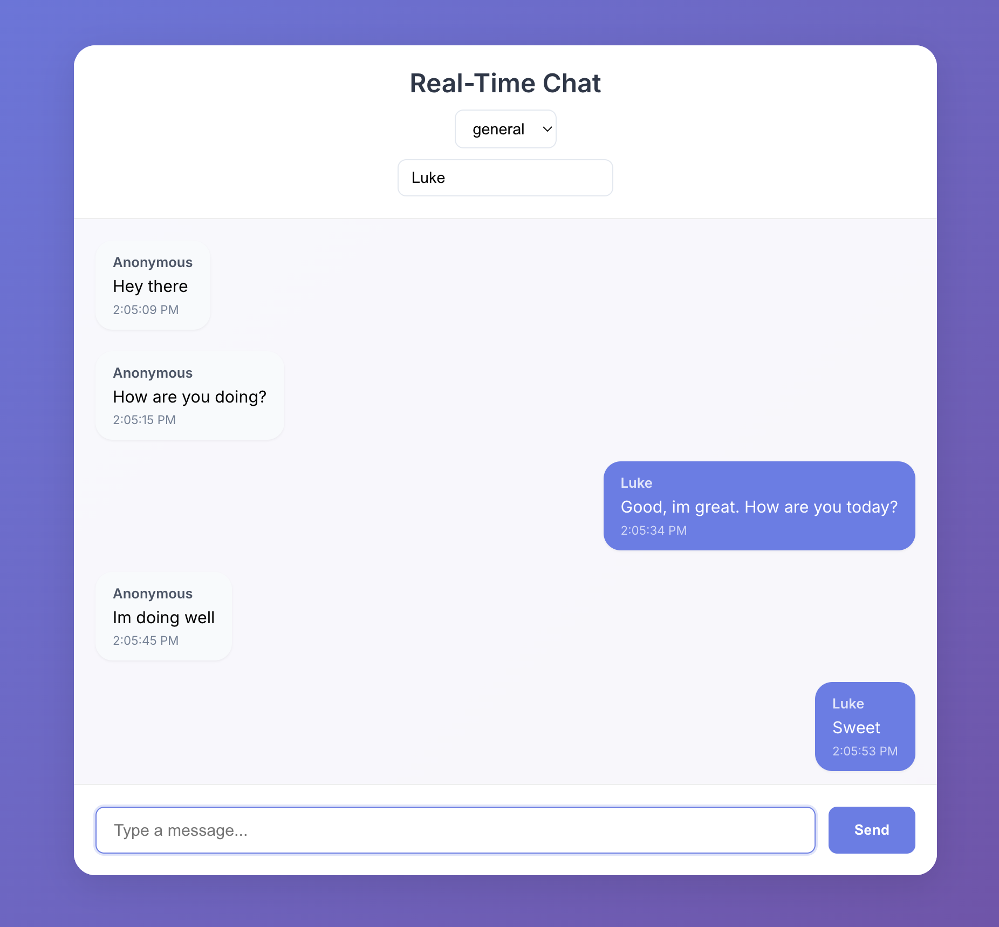

# Real-Time Chat Application

A modern real-time chat application built with **Quart** (Python async web framework) and React. This project demonstrates my expertise in building scalable, real-time applications using modern async Python practices and WebSocket communication.

## Demo



## Technical Highlights

- **Async-First Architecture**: Built with **Quart**, a modern async web framework that provides Flask-like syntax with async/await support
- **Real-time Communication**: Implemented using WebSockets with Quart's native WebSocket support
- **Type Safety**: Full TypeScript implementation in the frontend
- **Modern Frontend**: React components with Astro for static site generation
- **Scalable Design**: Room-based chat system with efficient message handling
- **Developer Experience**: Comprehensive development setup with hot-reloading

## Tech Stack

### Backend

- **Quart** - Async web framework
- **Hypercorn** - ASGI server
- **WebSockets** - Real-time communication
- **Python 3.11** - Modern Python features and type hints

### Frontend

- **React** - UI components
- **TypeScript** - Type safety
- **Astro** - Static site generation
- **WebSocket API** - Client-side real-time communication

## Prerequisites

- Node.js (v18 or higher)
- Python 3.11
- pipenv
- pnpm (v8 or higher)

## Installation

1. Clone the repository:

```bash
git clone https://github.com/yourusername/rtchat-quart.git
cd rtchat-quart
```

2. Install all dependencies:

```bash
pnpm run install:all
```

This will:

- Install root dependencies using pnpm
- Install frontend dependencies using pnpm
- Install backend Python dependencies using pipenv

## Development

To start the development servers:

```bash
pnpm run dev
```

This will start:

- Frontend server at http://localhost:3000
- Backend server at http://localhost:5001

## Building for Production

To build the frontend for production:

```bash
pnpm run build
```

## Project Structure

```
chat-app/
├── /frontend/              # React + TypeScript frontend
│   ├── /src/
│   │   ├── /components/   # React components
│   │   ├── /pages/        # Astro pages
│   │   └── /public/       # Static assets
│   ├── astro.config.mjs   # Astro configuration
│   └── package.json       # Frontend dependencies
├── /backend/              # Quart backend
│   ├── /app.py           # Main Quart application
│   └── /Pipfile         # Python dependencies
├── package.json          # Root-level scripts
└── README.md            # Project documentation
```

## Key Features

- **Async Web Framework**: Leverages Quart's async capabilities for efficient request handling
- **Real-time Updates**: WebSocket-based communication for instant message delivery
- **Type Safety**: Full TypeScript implementation ensuring code reliability
- **Modern UI**: Clean, responsive interface built with React
- **Room Management**: Support for multiple chat rooms with isolated conversations
- **User Customization**: Username and room selection features

## License

This project is licensed under the MIT License - see the LICENSE file for details.
